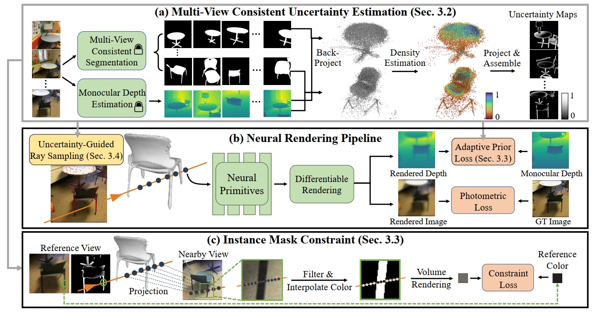
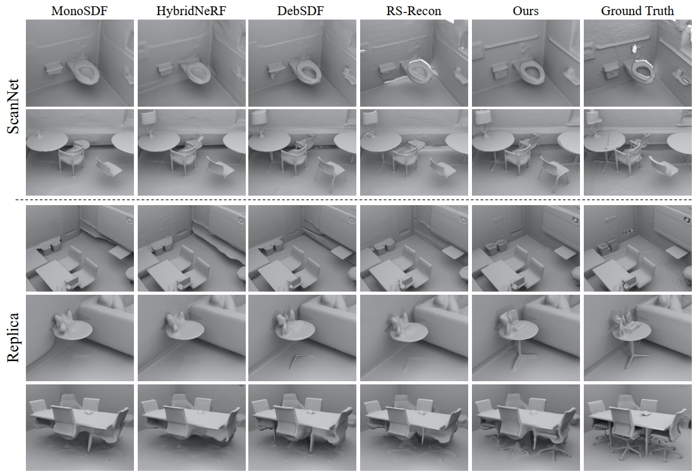

<p align="center" />
<h1 align="center">MonoInstance: Enhancing Monocular Priors via Multi-view Instance Alignment for Neural Rendering and Reconstruction</h1>

<p align="center">
    <a href="https://wen-yuan-zhang.github.io/"><strong>Wenyuan Zhang</strong></a>
    ·
    <a href=""><strong>Yixiao Yang</strong></a>
    ·
    <a href="https://github.com/alvin528"><strong>Han Huang</strong></a>
    ·
    <a href="https://github.com/hanl2010"><strong>Liang Han</strong></a>
    ·
    <a href=""><strong>Kanle Shi</strong></a>
    ·
    <a href="https://yushen-liu.github.io/"><strong>Yu-Shen Liu†</strong></a>
    ·
    <a href="https://h312h.github.io/"><strong>Zhizhong Han</strong></a>
</p>
<h2 align="center">CVPR 2025</h2>
<h3 align="center"><a href="https://arxiv.org/abs/2503.18363">Paper</a> | <a href="https://wen-yuan-zhang.github.io/MonoInstance/">Project Page</a></h3>
<div align="center"></div>
<div align="center"></div>
<p align="center">
    
</p>

In this paper, we introduce MonoInstance, which detects uncertainty in 3D according to inconsistent clues from monocular priors on multi-view. Our method is a general strategy to enhance monocular priors for various multi-view neural rendering and reconstruction frameworks. Based on the uncertainty maps, we introduce novel strategies to reduce the negative impact brought by inconsistent monocular clues and mine more reliable supervision through photometric consistency.

<p align="center">
    
    
</p>

# Preprocessed Datasets & Pretrained Meshes

Our preprocessed ScanNet and Replica datasets are provided in [This link](https://huggingface.co/datasets/zParquet/MonoInstance/tree/main).

Pretrained meshes are provided in [This link](https://drive.google.com/drive/folders/1D8wqi-fmcKUtcs9REYYv0KPM7uwPQAGs?usp=sharing).

# Setup

## Installation

Clone the repository and create an anaconda environment using
```shell
git clone https://github.com/wen-yuan-zhang/MonoInstance.git
cd MonoInstance

conda create -n monoinstance python=3.10
conda activate monoinstance

conda install pytorch=1.13.0 torchvision=0.14.0 cudatoolkit=11.7 -c pytorch
conda install cudatoolkit-dev=11.7 -c conda-forge

pip install -r requirements.txt
```

We use [Hi-Diff](https://github.com/zhengchen1999/HI-Diff) to preprocess ScanNet dataset to obtain deblurred images for better monocular estimation. To preprocess your own data, please follow the official instructions of its repo and download its checkpoints. We find the ```HI-Diff-RealBlur-J``` model performs best. 

We use [Metric3D v2](https://github.com/YvanYin/Metric3D) as our monocular depth & normal estimation backbone. To install Metric3D v2, please follow the official instructions of its repo and download its checkpoints. Put the checkpoints into ```Metric3D/checkpoints```.

We use [GroundedSAM](https://github.com/IDEA-Research/Grounded-Segment-Anything) to filter out the background (wall, ceiling, floor) areas in indoor scenarios. Please follow the official instructions of its repo and download its checkpoints. **Note:** The environment of GroundedSAM conficts with other repos. It is recommended to create a new virtual environment for running GoundedSAM. 


We use [MaskClustering](https://github.com/PKU-EPIC/MaskClustering) for multi-view consistent semantic segmentation. To install MaskClustering, please follow the official instructions of its repo.

We have put the adjusted Metric3D v2, MaskClustering, GroundedSAM repositories into our code. 


# Training

To train ScanNet, simply run
```shell
cd MonoInstance
chmod +x full_train_scannet.sh
CUDA_VISIBLE_DEVICES=1 ./full_train_scannet.sh
```

The training procedure includes five stages. (1) Train MonoInstance for the first 1/4 epochs. (2) Run MaskClustering to obtain multi-view consistent semantic segmentation. (3) Background segmentation using GroundedSAM. (4) Calculate monocular confidence. (5) Train MonoInstance for the rest epochs. After training, the meshes are automatically extracted in the experiment folder.

Similarly, to train Replica, run 
```shell
cd MonoInstance
chmod +x full_train_replica.sh
CUDA_VISIBLE_DEVICES=1 ./full_train_replica.sh
```

The scene name, experiment name, code/data path are specified in the script. You can adjust them as your own configurations.


# Evaluation

To evaluate ScanNet scenes, run 
```shell
cd MonoInstance/scannet_eval
python evaluate.py --scan scene0050_00 \
--ply_file ../exps/scannet_mlp_scene0050_00/full_mono0.2_warp0.4/plots/surface_189.ply 
```


To evaluate Replica scenes, run 
```shell
cd MonoInstance/replica_eval
CUDA_VISIBLE_DEVICES=4 python evaluate_single_scene.py --scan room1 \
--input_mesh ../exps/replica_mlp_room1/full_mono0.2_warp0.4/plots/surface_360.ply \
--output_dir ../exps/replica_mlp_room1/full_mono0.2_warp0.4/plots/evaluation
```


# Acknowledgements

This project is built upon [MonoSDF](https://niujinshuchong.github.io/monosdf/), [MaskClustering](https://pku-epic.github.io/MaskClustering/), [Metric3D v2](https://jugghm.github.io/Metric3Dv2/), [GroundedSAM](https://github.com/IDEA-Research/Grounded-Segment-Anything), [NeuSurf](https://alvin528.github.io/NeuSurf/), [FSGS](https://zehaozhu.github.io/FSGS/). It also borrows the warp implementation of [NeuralWarp](https://imagine.enpc.fr/~darmonf/NeuralWarp/).  We thank all the authors for their great repos.


# Citation

If you find our code or paper useful, please consider citing
```bibtex
@inproceedings{zhang2025monoinstance,
  title={{MonoInstance}: Enhancing monocular priors via multi-view instance alignment for neural rendering and reconstruction},
  author={Zhang, Wenyuan and Yang, Yixiao and Huang, Han and Han, Liang and Shi, Kanle and Liu, Yu-Shen and Han, Zhizhong},
  booktitle={Proceedings of the Computer Vision and Pattern Recognition Conference},
  pages={21642--21653},
  year={2025}
}
```

